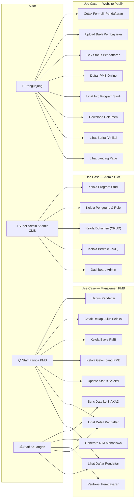
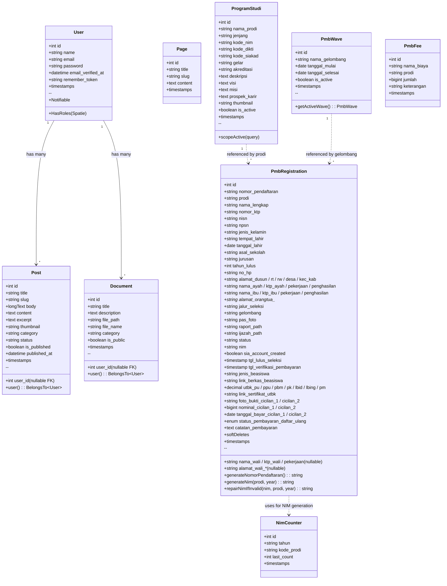
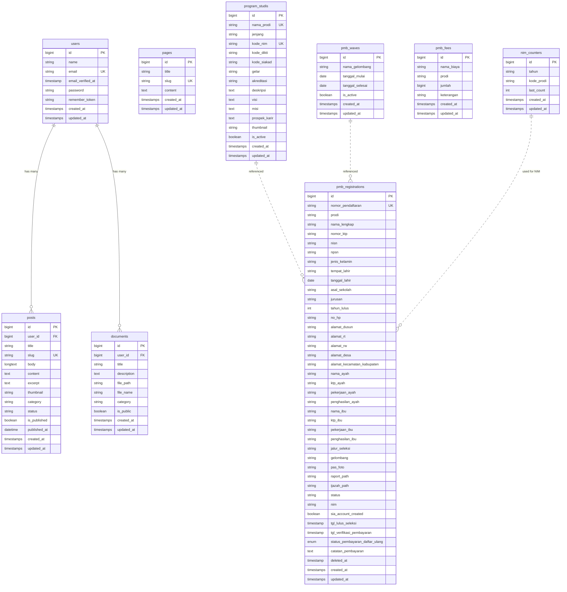
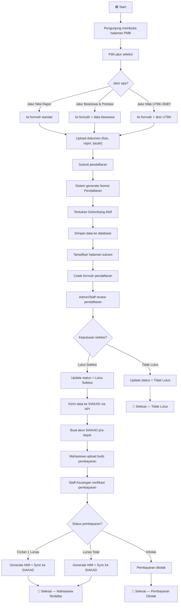
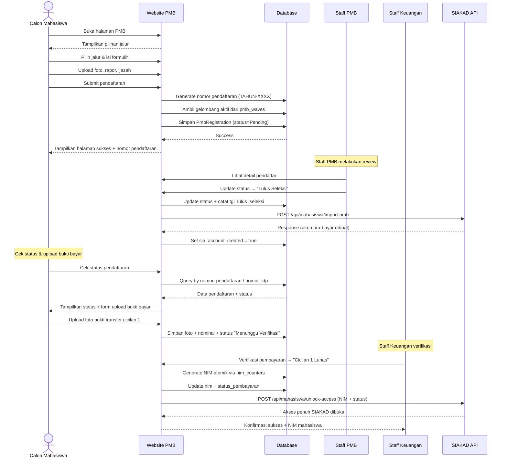
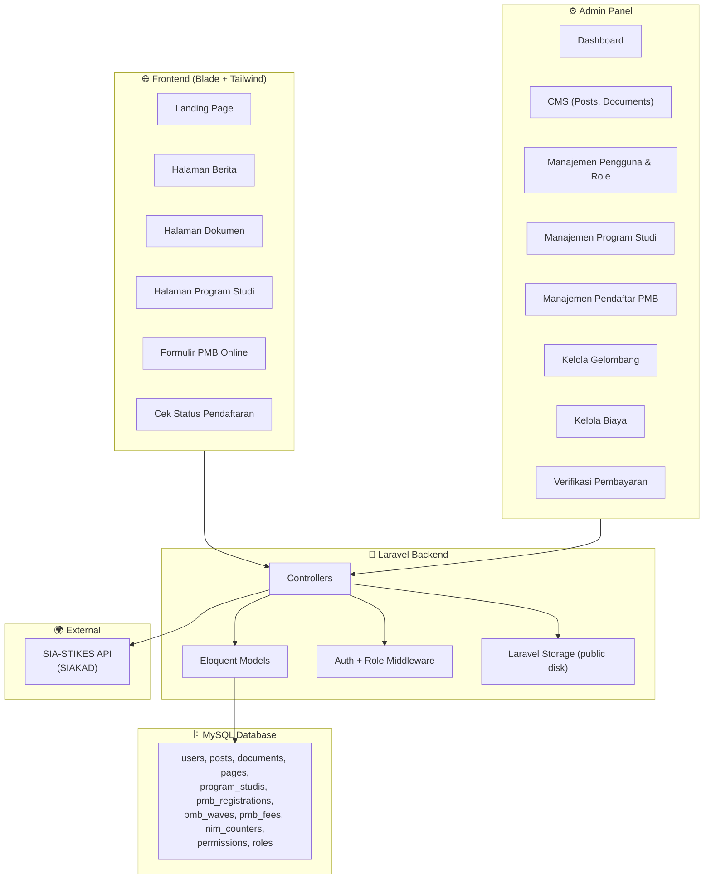
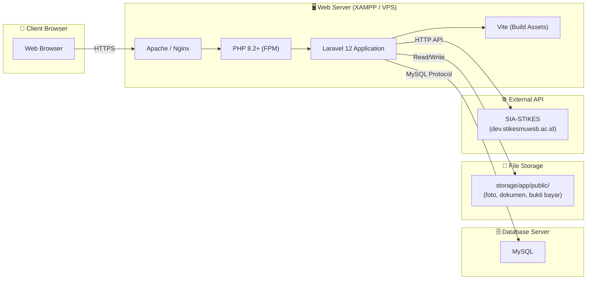
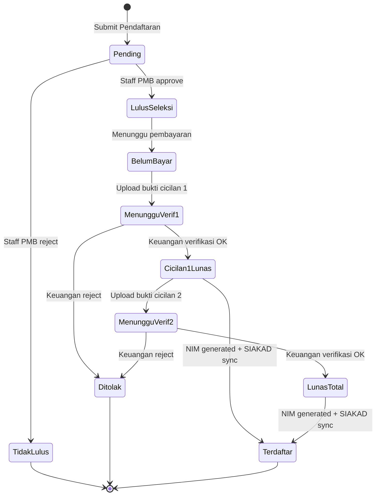

# 📖 Dokumentasi Project Website STIKES Muhammadiyah Wonosobo

## 1. Deskripsi Project

**Nama Project:** Website Resmi & Sistem PMB Online STIKES Muhammadiyah Wonosobo  
**Framework:** Laravel 12 (PHP 8.2+)  
**Frontend:** Blade + Tailwind CSS + Vite  
**Auth:** Laravel Breeze + Spatie Laravel Permission  
**Database:** MySQL  

Aplikasi web ini berfungsi sebagai **website resmi** dan **sistem Penerimaan Mahasiswa Baru (PMB) Online** untuk STIKES Muhammadiyah Wonosobo. Sistem terdiri dari dua bagian utama:

1. **Frontend (Publik)** — Landing page, berita/artikel, dokumen publik, informasi program studi, dan formulir pendaftaran PMB online.
2. **Backend (Admin CMS)** — Panel admin untuk mengelola berita, dokumen, pengguna, program studi, pendaftaran PMB, gelombang pendaftaran, biaya, verifikasi pembayaran, serta integrasi API ke sistem SIA-STIKES (SIAKAD).

---

## 2. Tech Stack

| Layer        | Teknologi                                  |
|--------------|--------------------------------------------|
| Backend      | Laravel 12, PHP 8.2+                       |
| Frontend     | Blade Templates, Tailwind CSS, Vite        |
| Auth         | Laravel Breeze                             |
| Authorization| Spatie Laravel Permission (RBAC)            |
| Database     | MySQL                                      |
| File Storage | Laravel Filesystem (public disk)           |
| Integrasi    | HTTP API ke SIA-STIKES (SIAKAD)            |
| Dev Tools    | Laravel Pint, Pail, PHPUnit, Faker         |

---

## 3. Aktor / Role Pengguna

| Role                  | Deskripsi                                                                  |
|-----------------------|----------------------------------------------------------------------------|
| **Pengunjung (Guest)**| Akses halaman publik, berita, dokumen, informasi prodi, formulir PMB       |
| **Super Admin**       | Akses penuh ke seluruh fitur admin                                         |
| **Admin CMS**         | Kelola berita, dokumen, pengguna, dan program studi                        |
| **Staff Panitia PMB** | Kelola data pendaftar, ubah status seleksi, cetak rekap                    |
| **Staff Keuangan**    | Verifikasi pembayaran daftar ulang, generate NIM, sinkronisasi ke SIAKAD   |

---

## 4. Diagram UML

### 4.1 Use Case Diagram



---

### 4.2 Class Diagram (Model Eloquent)



---

### 4.3 Entity-Relationship Diagram (ERD)



---

### 4.4 Activity Diagram — Alur Pendaftaran PMB Online



---

### 4.5 Sequence Diagram — Pendaftaran PMB & Verifikasi



---

### 4.6 Component Diagram



---

### 4.7 Deployment Diagram



---

## 5. Struktur Route

### 5.1 Route Publik (Guest)

| Method | URI | Controller / Action | Nama Route | Deskripsi |
|--------|-----|---------------------|------------|-----------|
| GET | `/` | Closure | — | Landing page |
| GET | `/berita` | PostController@index | `posts.index` | Daftar berita |
| GET | `/berita/{slug}` | PostController@show | `posts.show` | Detail berita |
| GET | `/dokumen` | DocumentController@index | `documents.index` | Daftar dokumen |
| GET | `/dokumen/{document}/download` | DocumentController@download | `documents.download` | Download dokumen |
| GET | `/halaman/{slug}` | PageController@show | `pages.show` | Halaman statis |
| GET | `/program-studi` | Closure | `prodi.index` | Daftar program studi |
| GET | `/pmb` | PmbController@jalur | `pmb.jalur` | Pilihan jalur PMB |
| GET | `/pmb/cek-status` | PmbController@checkStatus | `pmb.status_check` | Cek status pendaftaran |
| GET | `/pmb/daftar` | PmbController@create | `pmb.create` | Form pendaftaran |
| POST | `/pmb/daftar` | PmbController@store | `pmb.store` | Submit pendaftaran |
| GET | `/pmb/sukses/{id}` | PmbController@success | `pmb.success` | Halaman sukses |
| GET | `/pmb/cetak/{id}` | PmbController@print | `pmb.print` | Cetak formulir |
| POST | `/pmb/{id}/upload-bukti-bayar` | PmbController@uploadBuktiBayar | `pmb.upload_bukti_bayar` | Upload bukti transfer |

### 5.2 Route Admin (Protected: auth + role)

| Method | URI | Controller / Action | Nama Route | Hak Akses |
|--------|-----|---------------------|------------|-----------|
| GET | `/admin` | DashboardController@index | `admin.dashboard` | All Admin Roles |
| CRUD | `/admin/posts` | Admin\PostController | `admin.posts.*` | Super Admin, Admin CMS |
| CRUD | `/admin/documents` | Admin\DocumentController | `admin.documents.*` | Super Admin, Admin CMS |
| CRUD | `/admin/users` | Admin\UserController | `admin.users.*` | Super Admin, Admin CMS |
| CRUD | `/admin/program-studi` | Admin\ProgramStudiController | `admin.program-studi.*` | Super Admin, Admin CMS |
| PATCH | `/admin/program-studi/{id}/toggle-active` | toggleActive | `admin.program-studi.toggle_active` | Super Admin, Admin CMS |
| GET | `/admin/pmb` | Admin\PmbController@index | `admin.pmb.index` | All Admin Roles |
| GET | `/admin/pmb/print-rekap` | Admin\PmbController@printRekap | `admin.pmb.print_rekap` | All Admin Roles |
| GET | `/admin/pmb/{id}` | Admin\PmbController@show | `admin.pmb.show` | All Admin Roles |
| PUT | `/admin/pmb/{id}/status` | Admin\PmbController@updateStatus | `admin.pmb.status` | All Admin Roles |
| POST | `/admin/pmb/{id}/verify-payment` | Admin\PmbController@verifyPayment | `admin.pmb.verify_payment` | All Admin Roles |
| POST | `/admin/pmb/{id}/sync-sia` | Admin\PmbController@syncSia | `admin.pmb.sync_sia` | All Admin Roles |
| DELETE | `/admin/pmb/{id}` | Admin\PmbController@destroy | `admin.pmb.destroy` | All Admin Roles |
| GET/POST | `/admin/pmb-gelombang` | Admin\PmbWaveController | `admin.pmb_waves.*` | All Admin Roles |
| GET/POST | `/admin/pmb-biaya` | Admin\PmbFeeController | `admin.pmb_fees.*` | All Admin Roles |

---

## 6. Deskripsi Tabel Database

### 6.1 `users`
Tabel pengguna sistem (admin, staff). Menggunakan Spatie Permission untuk manajemen role.

### 6.2 `posts`
Tabel berita/artikel. Mendukung rich text editor, thumbnail, kategori, dan status draft/published.

### 6.3 `documents`
Tabel dokumen yang bisa didownload publik. Mendukung deskripsi, kategori, dan visibilitas (public/private).

### 6.4 `pages`
Tabel halaman statis (seperti profil, visi misi) yang diakses via slug.

### 6.5 `program_studis`
Master data program studi. Menyimpan informasi lengkap prodi termasuk kode NIM, kode DIKTI, kode SIAKAD, akreditasi, visi, misi, dan prospek karir.

### 6.6 `pmb_registrations`
Tabel utama pendaftaran mahasiswa baru. Menyimpan seluruh data pribadi, orang tua/wali, berkas, status seleksi, NIM, dan status pembayaran. Menggunakan **Soft Deletes** agar nomor pendaftaran tidak di-reuse.

### 6.7 `pmb_waves`
Gelombang pendaftaran PMB. Setiap gelombang punya periode aktif (tanggal mulai s/d selesai).

### 6.8 `pmb_fees`
Biaya-biaya pendaftaran/registrasi ulang per program studi.

### 6.9 `nim_counters`
Counter atomik untuk generate NIM secara sekuensial per tahun dan kode prodi. Format NIM: `[Angkatan 3 digit][Tahun 2 digit][Kode Prodi 4 digit][Urut 3 digit]`.

### 6.10 Permission Tables (Spatie)
`roles`, `permissions`, `model_has_roles`, `model_has_permissions`, `role_has_permissions` — Tabel standar Spatie Laravel Permission untuk RBAC.

---

## 7. Fitur Utama

### 7.1 Pendaftaran PMB Online
- 3 jalur seleksi: **Jalur Nilai Rapor**, **Jalur Beasiswa & Prestasi**, **Jalur Nilai UTBK-SNBT**
- Upload berkas (pas foto, rapor, ijazah) secara online
- Penentuan gelombang pendaftaran otomatis berdasarkan tanggal
- Generate nomor pendaftaran unik (format: `TAHUN-XXXX`)

### 7.2 Manajemen Seleksi
- Admin bisa mengubah status: Pending → Lulus Seleksi / Tidak Lulus
- Otomatis sinkronisasi ke SIAKAD saat status "Lulus Seleksi"

### 7.3 Pembayaran Daftar Ulang
- Mahasiswa upload bukti transfer (cicilan 1 / cicilan 2)
- Staff Keuangan verifikasi pembayaran
- Status: Belum Bayar → Menunggu Verifikasi → Cicilan 1 Lunas → Lunas Total / Ditolak
- **Generate NIM atomik** saat pembayaran terverifikasi

### 7.4 Integrasi SIAKAD
- API endpoint: `POST /api/mahasiswa/import-pmb` — Import data pendaftar
- API endpoint: `POST /api/mahasiswa/unlock-access` — Buka akses penuh setelah bayar
- Menggunakan `X-PMB-Secret` header untuk autentikasi API

### 7.5 CMS (Content Management System)
- CRUD Berita dengan rich text editor dan upload gambar
- CRUD Dokumen yang bisa didownload
- Halaman statis (via Pages)

### 7.6 Manajemen Program Studi
- CRUD program studi lengkap dengan informasi visi, misi, prospek karir
- Toggle aktif/nonaktif prodi di PMB

---

## 8. Format NIM

```
Format: [AAA][TT][PPPP][NNN]

AAA  = Tahun Angkatan 3 digit (base 2018, contoh: 2026 = 008)
TT   = Tahun Terdaftar 2 digit (contoh: 2026 = 26)
PPPP = Kode Prodi 4 digit (S1 Farmasi = 0101, S1 Gizi = 0201)
NNN  = Nomor Urut 3 digit (counter atomik per tahun+prodi)

Contoh: 008260101001 = Angkatan 008, Tahun 26, Farmasi (0101), Urut 001
```

---

## 9. Alur Status Pendaftaran



---

## 10. Struktur Direktori Project

```
STIKESMU/
├── app/
│   ├── Http/
│   │   ├── Controllers/
│   │   │   ├── Admin/
│   │   │   │   ├── DashboardController.php
│   │   │   │   ├── DocumentController.php
│   │   │   │   ├── PmbController.php
│   │   │   │   ├── PmbFeeController.php
│   │   │   │   ├── PmbWaveController.php
│   │   │   │   ├── PostController.php
│   │   │   │   ├── ProgramStudiController.php
│   │   │   │   └── UserController.php
│   │   │   ├── Auth/ (Laravel Breeze)
│   │   │   ├── DocumentController.php
│   │   │   ├── PageController.php
│   │   │   ├── PmbController.php
│   │   │   ├── PostController.php
│   │   │   └── ProfileController.php
│   │   └── Middleware/
│   └── Models/
│       ├── Document.php
│       ├── Page.php
│       ├── PmbFee.php
│       ├── PmbRegistration.php
│       ├── PmbWave.php
│       ├── Post.php
│       ├── ProgramStudi.php
│       └── User.php
├── database/
│   └── migrations/ (21 migration files)
├── resources/
│   └── views/
├── routes/
│   ├── web.php
│   └── auth.php
├── public/
├── config/
└── storage/
```
